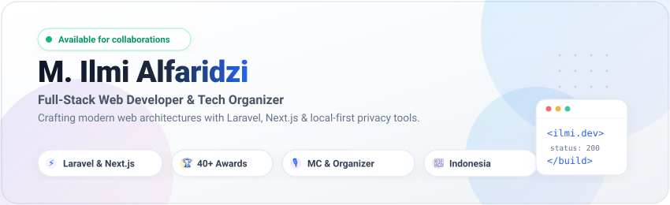

  <!-- Header Banner -->
  

   

  <!-- Animated Typing Headline (Light Slate & Royal Blue) -->
  

  

    <strong>Informatics Student &bull; Web Artisan &bull; Public Speaker</strong>
  

  <!-- Social & Quick Connect Badges (Clean Light Palette) -->
  

    
    &nbsp;
    
    &nbsp;
    
    &nbsp;
    
    &nbsp;
    
  

---

### 💫 About Me

Hi there! I am **M. Ilmi Alfaridzi**, a Full-Stack Web Developer based in Indonesia. I love architecting web applications that bridge high-performance frontend interactivity with robust, scalable backend systems.

- 🔭 **Current Focus**: Modern full-stack ecosystems using **Laravel 12 / Inertia.js**, **Next.js (App Router)**, **TypeScript**, and **local-first WebAssembly tools**.
- 🛠️ **Developer Mindset**: Passionate about **clean code**, **client-side privacy**, **developer ergonomics**, and crafting pixel-perfect interfaces.
- 🎙️ **Leadership & Public Speaking**: Active Master of Ceremony (including **Wisuda ke-28 UMRI**), event organizer, and initiative lead for technology study clubs.
- 🏆 **Achievements**: Honored with **40+ awards & accolades** across technology competitions, national events, debates, and public speaking.
- ⚡ **Fun Fact**: I believe great software should be as delightful under the hood as it is on the screen!

---

### 🛠️ Tech Stack &amp; Tooling

  
   
  

 

| Domain | Technologies &amp; Frameworks |
| :--- | :--- |
| **Frontend** | React, Next.js (App Router / Turbopack), TypeScript, JavaScript (ESNext), Tailwind CSS, Framer Motion, Recharts |
| **Backend &amp; Architecture** | Laravel (v11/v12), PHP (8.3+), Inertia.js, Filament PHP, RESTful APIs, Spatie Roles &amp; Permissions |
| **Data &amp; Storage** | MySQL, SQLite, Client-Side IndexedDB / Local Storage |
| **Tooling &amp; Workflow** | Git, GitHub, Vite, Vitest, Postman, Composer, pnpm/npm, Figma, Vercel |

---

### 🚀 Featured Projects Showcase

Every project is tailored with a unique identity and crafted to solve real-world challenges:

<table>
  <tr>
    <td width="50%" valign="top">
      <h4 align="left">⚡ <a href="https://github.com/Ilmialfa/OmniConvert">OmniConvert</a></h4>
      
<em>Browser-First File Conversion Toolkit with 100% Client-Side Privacy</em>

      

        
        
        
        
      

      <ul>
        <li>Converts <strong>56+ file formats</strong> (Images, PDFs, Documents, Audio, Video, Structured Data).</li>
        <li>Processed entirely on the user's browser using WebAssembly — zero files sent to servers.</li>
        <li>Includes OCR image-to-text, PWA offline support, and multi-file batch queues.</li>
      </ul>
      
🔗 <a href="https://omniconvert-mu.vercel.app"><strong>Live Web App</strong></a> &bull; <a href="https://github.com/Ilmialfa/OmniConvert"><strong>Repository</strong></a>

    </td>
    <td width="50%" valign="top">
      <h4 align="left">🧠 <a href="https://github.com/Ilmialfa/finsight-ai">FinSight AI</a></h4>
      
<em>AI-Powered Financial Intelligence &amp; Predictive Analytics Dashboard</em>

      

        
        
        
        
      

      <ul>
        <li>Automated financial categorization with OpenAI LLM assistance.</li>
        <li>Interactive budgeting insights, cashflow forecast charts, and health scores.</li>
        <li>Fluid micro-interactions powered by Framer Motion and modern Tailwind CSS.</li>
      </ul>
      
🔗 <a href="https://github.com/Ilmialfa/finsight-ai"><strong>Explore Repository</strong></a>

    </td>
  </tr>
  <tr>
    <td width="50%" valign="top">
      <h4 align="left">🏛️ <a href="https://github.com/Ilmialfa/website-batik-kkn">Website Batik KKN</a></h4>
      
<em>Cultural Heritage Digitization &amp; UMKM E-Commerce Platform</em>

      

        
        
        
        
      

      <ul>
        <li>Digital catalog of authentic local batik patterns with cultural history archives.</li>
        <li>Direct marketplace connecting local artisans with buyers.</li>
        <li>Comprehensive content &amp; sales management via Filament Admin.</li>
      </ul>
      
🔗 <a href="https://github.com/Ilmialfa/website-batik-kkn"><strong>Explore Repository</strong></a>

    </td>
    <td width="50%" valign="top">
      <h4 align="left">🏪 <a href="https://github.com/Ilmialfa/toko-putera-kembar">Toko Putera Kembar</a></h4>
      
<em>Modern Retail Point of Sale &amp; Enterprise Inventory System</em>

      

        
        
        
        
      

      <ul>
        <li>Blazing fast checkout cashier terminal with real-time stock sync.</li>
        <li>Role-based access control (Admin, Cashier, Warehouse Supervisor).</li>
        <li>Automated background database backups and sales analytics reports.</li>
      </ul>
      
🔗 <a href="https://github.com/Ilmialfa/toko-putera-kembar"><strong>Explore Repository</strong></a>

    </td>
  </tr>
</table>

---

### 🎮 Mini Game &amp; Interactive Dev Quest

Take a short break! Can you solve this developer riddle?

  
🕹️ <strong>Quest #1: The Bug in the Production Pipeline</strong> (Click to Play)

   
  <blockquote>
    <em>You are deploying a high-priority web feature. Users report: "The converter app freezes when converting an 80MB video file!"</em>
      
    <strong>Which strategy solves this gracefully without crashing the UI thread?</strong>
      
    🅰️ Run the FFmpeg binary directly inside the main React component state. 
    🅱️ Offload the WebAssembly decoding to a dedicated <strong>Web Worker</strong> with progress streams. 
    🅲 Increase JavaScript heap memory limit in browser devtools.
  </blockquote>

  

    
🔍 <strong>Reveal Answer &amp; Solution</strong>

     
    <blockquote>
      ✅ <strong>Correct Choice: 🅱️ Dedicated Web Worker!</strong> 
      <em>Why?</em> Moving heavy computations (such as WASM video transcoding in <strong>OmniConvert</strong>) to a background Web Worker ensures the main UI thread stays at a silky 60 FPS while reporting real-time percentage progress!
    </blockquote>
  

  
🎲 <strong>Quest #2: Guess the Tech Stack Match</strong> (Click to Play)

   
  <blockquote>
    <strong>Match the scenario with the optimal architecture:</strong> 
    1. Single developer needing full-stack React elegance + Laravel's battle-tested ORM/Auth. 
    2. Blazing fast client-side document processing with zero cloud data footprint. 
  </blockquote>

  

    
🔍 <strong>Reveal Answer</strong>

     
    <blockquote>
      1. 💡 <strong>Laravel + Inertia.js (React)</strong> (Powering <em>Toko Putera Kembar</em> &amp; <em>Website Batik</em>) 
      2. 💡 <strong>Next.js + WebAssembly (WASM)</strong> (Powering <em>OmniConvert</em>)
    </blockquote>
  

---

### 📊 GitHub Activity &amp; Analytics (Light Mode)

  <table border="0">
    <tr>
      <td align="center" valign="middle">
        
      </td>
      <td align="center" valign="middle">
        
      </td>
    </tr>
    <tr>
      <td colspan="2" align="center">
        
      </td>
    </tr>
  </table>

---

### 🐍 Contribution Activity Snake

  

---

  

    <em>"Crafting code with empathy, designing systems for simplicity."</em>
  

  

    
  

  

    &copy; 2026 <strong>M. Ilmi Alfaridzi</strong>. All rights reserved.
  

